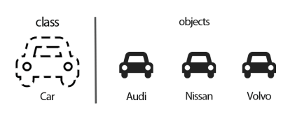

# Introduktion till klasser och objekt

Note:
This will only display in the notes window.
yhjj
hjhkhk

hjh
* a
* b

---

## Vad är en klass ?

En gruppering av funktioner och variabler
<!-- .element: class="fragment" -->

En mall som man skapar objekt från
<!-- .element: class="fragment" -->

<!-- .element: class="fragment" -->

--

### Varför klasser?

Ni har jobbat med funktioner och variabler
<!-- .element: class="fragment" -->

Det kan bli grötigt i stora projekt
<!-- .element: class="fragment" -->

Med klasser kan man dela upp koden modulärt
<!-- .element: class="fragment" -->

--
<!-- .slide: data-transition="slide-in fade-out" -->

